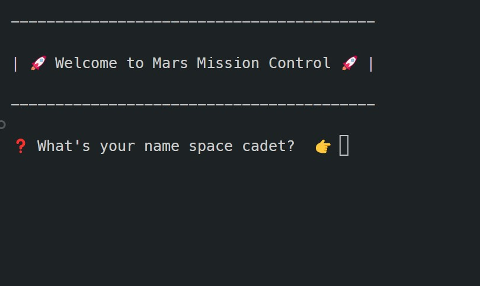
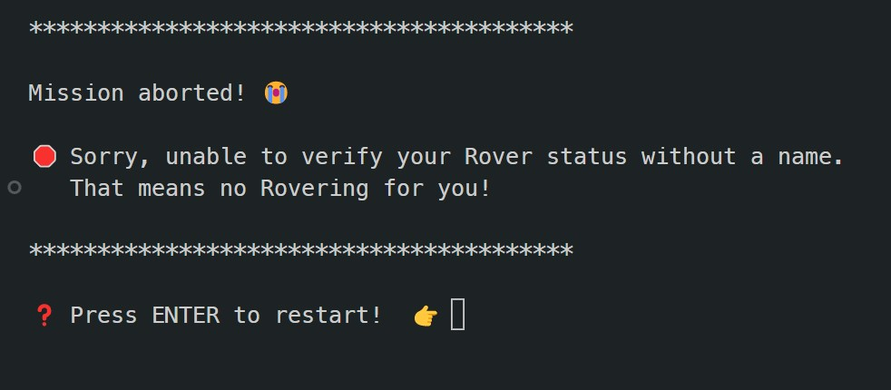
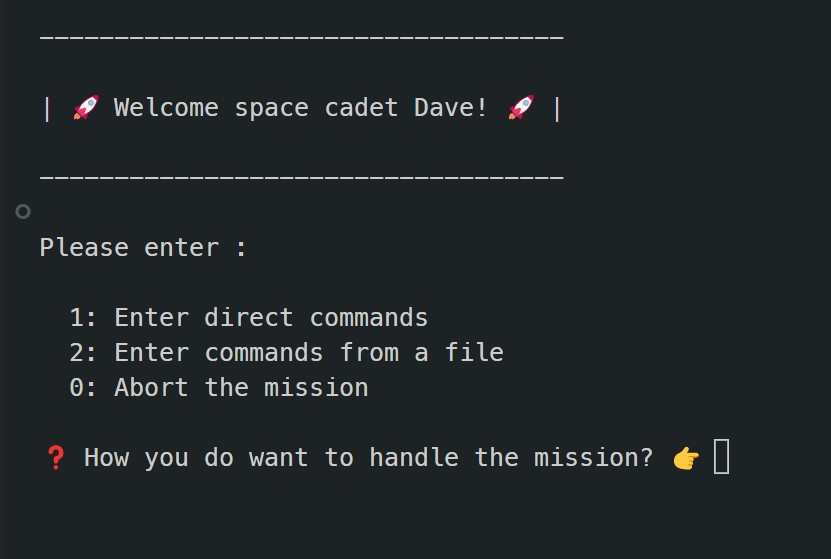
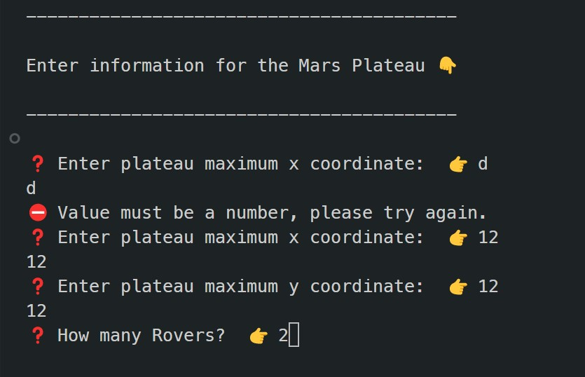
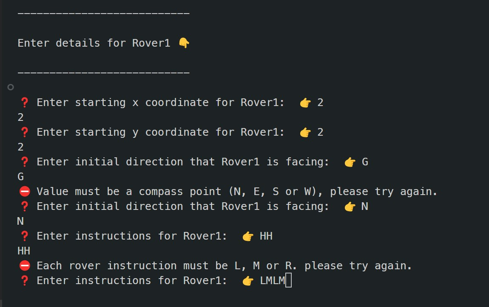
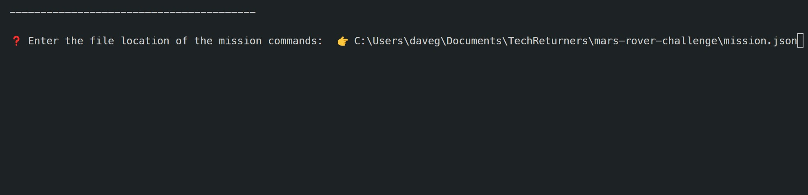
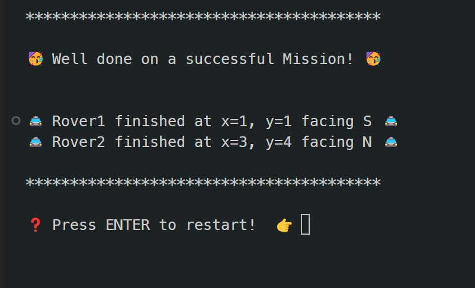
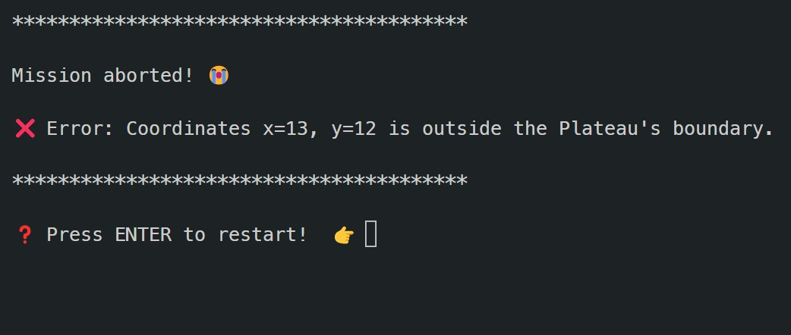
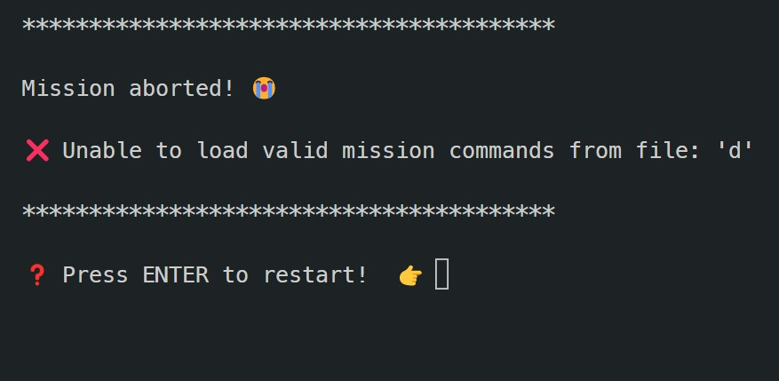

# 🚀 Mars Rover Challenge 🚀

## The Challenge

You have been asked to create a program to move rovers around the surface of Mars!
✨
The surface of Mars is represented by a Plateau, you can make the assumption that the
Plateau is a square/rectangular grid for the purpose of this task.
Rovers navigate the Plateau so they can use their special cameras 📷 and robot arms
🦾 to collect samples back to Planet Earth 🌏

### Assumptions

The design was based on the following assumptions:
- Plateau is rectangular and the furthest extent x, y coordinate is provided to determine the boundaries of the plateau.
- Each Rover will fulfil its whole set of instructions before any subsequent Rovers start their instructions.
- A Rover cannot move to a point that is occupied by another rover and if a move would result in this then an error is thrown.
- A Rover cannot move outside the boundaries of the plateau.

### The Design

I went for a heavily typed solution based on the brief and the assumptions above. I broke down the problem into the follwing areas of responsibility:

#### The Rover
I implemented the rover itself as a class which encapsulates the attributes and behaviour for each rover such as:
- setting initial coordinates and orientation
- rotation and movement on the plateau

The Rover class holds the positional state for the individual rover during the Mars Mission.

#### The Plateau
I created a separate javascript file to validate the data for the Mars Plateau, it does the following:
- validates that the initial coordinates for the plateau
- validates that a given rover move remains within the boundaries of the plateau

#### Mars Mission Control
This is where the inputs for the Mars Mission are processed and validated and then the mission is undertaken. It does the following:
- validates the Mars Plateau parameters and throws appropriate error if not
- creates the requisite number of rovers
- processes the commands for each rover where valid and throws appropriate error if not
- returns the finishing coordinates and orientation for the given rovers

Therefore one of the following outcomes will occur:
- Error if plateau parameters are invalid
- Error if a rover would collide with another rover or fall off the plateau
- Success when the mission runs smoothly

### Starting with TDD

I initially started with a TDD approach based on the design above and created tests for each area of responsibility. The tests test for valid and not valid data being provided. Obviously the use of TypeScript minimises the need for certain data validation.

### Console Input

After completing the initial design I implemented a way of running the Mars Mission from the command line. I split the reponsibilities into the following:
- `index.ts` - contains the logic for navigating the application
- `console.ts` - handles the execution of printing to and inputting from the console, as well as validation of inputs

#### Running the Mars Mission

##### Start screen

Enter your name to enter mission control. If You don't you can't rover!

##### Mission choices

Enter 1 to add mission parameters manually.
Enter 2 to add mission parameters from a file.

##### Enter parameters manually

First Enter the plateau details

Next add the details for each Rover on the mission.

If you type invalid responses then a warning is shown and the question is asked again.

##### Enter mission from file

Type in a valid file that contains valid mission commands.

##### Successful Mission! 

The final destinations for each Rover is displayed

##### Unsuccessful Mission

If an error occurs during the mission then the mission aborts and an error is shown.

If reading from an invalid file or contents is invalid then the mission is aborted.

